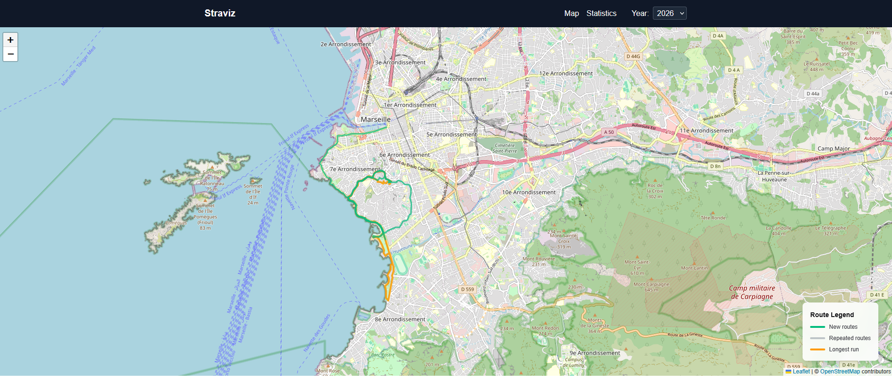
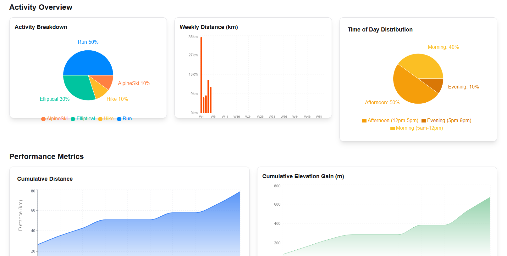

# Straviz

**Straviz** is a web application that visualizes your Strava activities. It fetches your activity data from Strava, stores it in a database, and provides a rich set of interactive charts and maps to explore your fitness journey.



## Features



- **Activity Synchronization**: Automatically syncs your activities from Strava.
- **Interactive Map**: Visualize your routes on a map.
- **Comprehensive Statistics**:
  - **Weekly Distance**: Track your weekly mileage.
  - **Activity Type Breakdown**: See the distribution of your activities (Run, Ride, Swim, etc.).
  - **Elevation Gain**: Track your cumulative elevation gain over the year.
  - **Intensity vs Duration**: Analyze the relationship between your speed/intensity and duration.
  - **Activity Heatmap**: Visualize your workout frequency throughout the year.
- **Personalized Summary**: Get a quick overview of your year's achievements.

## Tech Stack

The project is built using modern web technologies:

- **Frontend**: [Next.js](https://nextjs.org/) (React), Tailwind CSS, Recharts, Leaflet/Mapbox.
- **Backend**: [FastAPI](https://fastapi.tiangolo.com/) (Python).
- **Database**: [PostgreSQL](https://www.postgresql.org/).
- **Containerization**: [Docker](https://www.docker.com/) & Docker Compose.

## Prerequisites

Before running the application, ensure you have the following installed:

- [Docker Desktop](https://www.docker.com/products/docker-desktop/)
- [Git](https://git-scm.com/)

You also need a **Strava API Application**. You can create one at [https://www.strava.com/settings/api](https://www.strava.com/settings/api).

## Installation & Setup

1.  **Clone the repository:**

    ```bash
    git clone <repository-url>
    cd Straviz
    ```

2.  **Configure Environment Variables:**

    Create a `.env` file in the root directory based on the `.env.example` (if available) or add the following:

    ```env
    # Strava API Credentials
    STRAVA_CLIENT_ID=your_client_id
    STRAVA_CLIENT_SECRET=your_client_secret
    STRAVA_REFRESH_TOKEN=your_refresh_token

    # Database Configuration
    POSTGRES_USER=user
    POSTGRES_PASSWORD=password
    POSTGRES_DB=straviz_db

    # Backend
    BACKEND_PORT=8000
    ```

    > **Note:** To get your `STRAVA_REFRESH_TOKEN`, you'll need to perform an initial OAuth handshake with Strava.

3.  **Run with Docker Compose:**

    ```bash
    docker-compose up --build
    ```

    This command will build the frontend and backend images and start the PostgreSQL database.

4.  **Access the Application:**

    - **Frontend**: Open [http://localhost:3000](http://localhost:3000) in your browser.
    - **Backend API Docs**: Open [http://localhost:8000/docs](http://localhost:8000/docs) to explore the API endpoints.

## Project Structure

```
Straviz/
├── backend/            # Python/FastAPI backend code
│   ├── main.py         # App entry point
│   ├── routes/         # API endpoints
│   ├── database/       # Database models and connection
│   └── services/       # Business logic (Strava sync, etc.)
├── frontend/           # Next.js frontend code
│   ├── app/            # App router pages (Stats, Map, etc.)
│   ├── components/     # Reusable UI components & charts
│   └── utils/          # Helper functions
├── docker-compose.yml  # Container orchestration config
└── ...
```

## Usage

1.  **Sync Data**: enter the docker container and run the sync_db.py script in the scripts folder
```
docker exec -it straviz-backend-1 scripts/sync_db.py
```
2.  **View Stats**: Navigate to the "Statistics" page to view detailed charts.
3.  **Explore Map**: Use the main map view to filter and see your route history.

## Contributing

Contributions are welcome! Please feel free to submit a Pull Request.